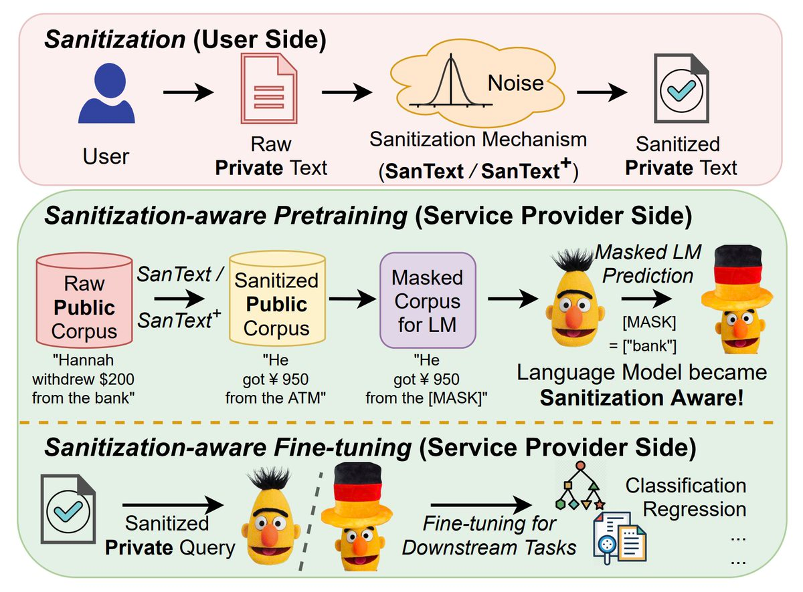

# SanText
Code for Findings of ACL-IJCNLP 2021 **"[Differential Privacy for Text Analytics via Natural Text Sanitization](https://arxiv.org/pdf/2106.01221.pdf)"**

Please kindly cite the paper if you use the code or any resources in this repo:
```bib
@inproceedings{ACL21/YueDu21,
  author    = {Xiang Yue and Minxin Du and Tianhao Wang and Yaliang Li and Huan Sun and Sherman S. M. Chow},
  title     = {Differential Privacy for Text Analytics via Natural Text Sanitization},
  booktitle = {Findings, {ACL-IJCNLP} 2021},
  year      = {2021},
  }
```
**The first two authors contributed equally to this work.**

## Introduction
The privacy issue is often overlooked in NLP. 
We address privacy from the root: 
directly producing sanitized text documents based on differential privacy.
We further propose sanitization-aware pretraining and finetuning to adapt the currently dominating LM (e.g., BERT) over sanitized texts. It “prepares” the model to work with sanitized texts, which leads to an increase in accuracy while additionally ensuring privacy.

<p align="center">

</p>


## Setup Environment
### Install required packages
```shell
git clone https://github.com/xiangyue9607/SanText.git
cd SanText
pip install -r requirements.txt
```
### Download the experimental data
We used three datasets in our paper: SST2, QNLI and CliniSTS. SST2 and QNLI 
are from [GLUE benchmark](https://gluebenchmark.com/tasks) and they are public available.
CliniSTS is not public available. Contact their [paper](https://arxiv.org/abs/1808.09397) authors for more details to access the data.
```shell
./download.sh
```


## Sanitize the text inputs
We propose two sanitized mechanisms based on differential privacy: **SanText** and **SanText+**.
Here we show some examples for running these algorithms:
```shell
 python run_SanText.py \
  --task SST-2 \
  --method SanText \
  --epsilon 3.0 \
  --word_embedding_path ./data/glove.840B.300d.txt \
  --word_embedding_size 300 \
  --data_dir ./data/SST-2/ \
  --output_dir ./output_SanText_glove/SST-2/ \
  --threads 8 
```

```shell
 python run_SanText.py \
  --task SST-2 \
  --method SanText \
  --embedding_type bert \
  --epsilon 14.0 \
  --data_dir ./data/SST-2/ \
  --output_dir ./output_SanText_bert/SST-2/ \
  --threads 8 
```

```shell
  python run_SanText.py \
  --task QNLI \
  --method SanText_plus \
  --epsilon 1.0 \
  --word_embedding_path ./data/glove.840B.300d.txt \
  --word_embedding_size 300 \
  --data_dir ./data/QNLI/ \
  --output_dir ./output_SanText_plus_glove/QNLI/ \
  --threads 12 \
  --p 0.3 \
  --sensitive_word_percentage 0.9 
```


## Finetune sanitization-aware BERT models
We then show examples how to finetune BERT models to do NLP tasks based on these sanitized texts in the previous step.
  
```shell
python run_glue.py \
  --model_name_or_path bert-base-uncased \
  --task_name sst-2 \
  --do_train \
  --do_eval \
  --data_dir ./output_SanText_glove/SST-2/eps_3.00/ \
  --max_seq_length 128 \
  --per_device_train_batch_size 64 \
  --per_device_eval_batch_size 64 \
  --learning_rate 2e-5 \
  --num_train_epochs 3.0 \
  --output_dir ./tmp/sst2-sanitize/ \
  --overwrite_output_dir \
  --overwrite_cache \
  --save_steps 2000
```

```shell
python run_glue.py \
  --model_name_or_path bert-base-uncased \
  --task_name qnli \
  --do_train \
  --do_eval \
  --data_dir ./output_SanText_plus_glove/QNLI/eps_1.00/sword_0.90_p_0.30 \
  --max_seq_length 128 \
  --per_device_train_batch_size 64 \
  --per_device_eval_batch_size 64 \
  --learning_rate 2e-5 \
  --num_train_epochs 2.0 \
  --output_dir ./tmp/qnli-sanitize/ \
  --overwrite_output_dir \
  --overwrite_cache \
  --save_steps 2000
```

## Pretrain sanitization-aware BERT models (optional)
We finally show how to pretrain sanitization-aware BERT models based on the public corpus such as Wikipedia.
Note that this step training is often time-consuming and costly. We denote this step as optional, however,
sanitization-aware pretrain can improve the model's performance in the downstream tasks while not hurting the privacy.

Here we give an example based on a very small subset of the Wikipedia ([WikiText-2](https://www.salesforce.com/products/einstein/ai-research/the-wikitext-dependency-language-modeling-dataset/)). 

```shell
python run_language_modeling.py \
--output_dir ./tmp/pretraining_bert_eps12_wiki2/ \
--model_type bert \
--model_name_or_path bert-base-uncased \
--do_train \
--train_data_file ./data/wikitext-2/wiki.train.tokens \
--do_eval \
--eval_data_file ./data/wikitext-2/wiki.valid.tokens \
--mlm \
--per_device_train_batch_size 8 \
--per_device_eval_batch_size 8 \
--logging_steps 500 \
--save_steps 5000 \
--overwrite_output_dir \
--epsilon 12.0 \
--num_train_epochs 1.0 \
--warmup_steps 3000 \
--threads 24
```


You can use your own training data to replace the example data. 
We also hardcode the full Wikipedia data (by loading from the [Huggingface Wikipedia dataset](https://huggingface.co/datasets/wikipedia))
If you want to enable the full wiki pretraining, you can run the following (i.e., let ```train_data_file = Wikipedia```):
```shell
python run_language_modeling.py \
--output_dir ./tmp/pretraining_bert_eps12_wiki_all/ \
--model_type bert \
--model_name_or_path bert-base-uncased \
--do_train \
--train_data_file Wikipedia \
--do_eval \
--eval_data_file ./data/wikitext-2/wiki.valid.tokens \
--mlm \
--per_device_train_batch_size 8 \
--per_device_eval_batch_size 8 \
--logging_steps 500 \
--save_steps 5000 \
--overwrite_output_dir \
--epsilon 12.0 \
--num_train_epochs 1.0 \
--warmup_steps 3000 \
--threads 24
```

Note that if you enable full wiki training, it will be really time-consuming. 
The data preprocessing often takes more than 10 hours. We released our pretrained models 
